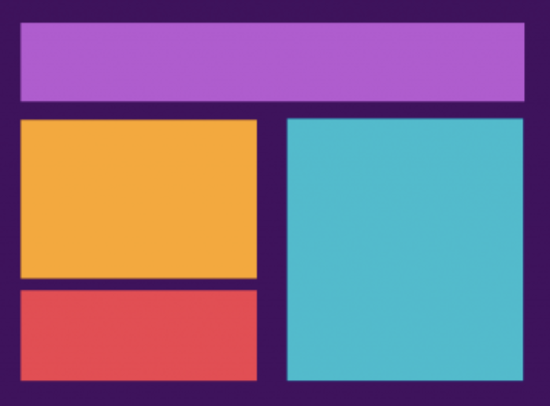
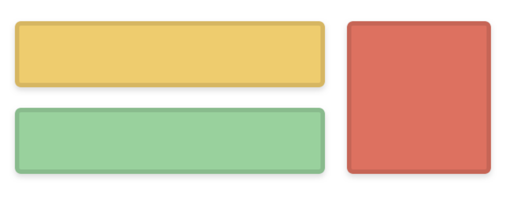
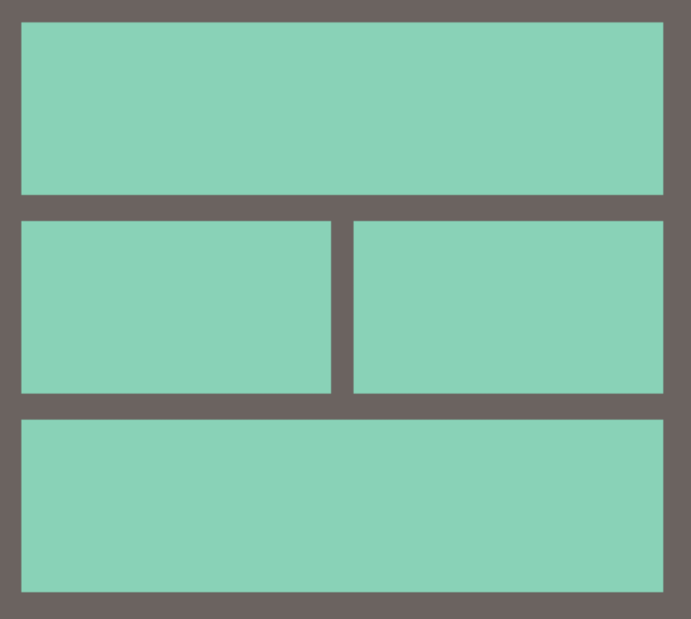

## Ejercicio en casa
pueden escoger un tema cualquiera que les guste mucho, por ejemplo anime, MARVEL, rugby, cocina, etc, y usando los tags de html y lo aprendido hoy sobre layout en css deben realizar una pagina sencilla en la cual tendremos un texto de introduccion, un video donde veamos algo relacionado con el tema de la pagina y una explicacion de pq escogieron ese tema.

les dejo un par de ejemplos de layouts sencillos que pueden lograr usando [flex](https://css-tricks.com/snippets/css/a-guide-to-flexbox/) o [grid](https://css-tricks.com/snippets/css/complete-guide-grid/), la idea es replicar alguno de esos layouts, no es necesario que usen color, background o elementos visuales, la meta de este taller es solamente el layout.

recuerden utilizar [padding](https://developer.mozilla.org/en-US/docs/Web/CSS/padding) y/o [margin](https://developer.mozilla.org/en-US/docs/Web/CSS/margin) cuando sea necesario y las unidades de medida que corresponden a lo que uds desean lograr.

### Ejemplos de layouts

